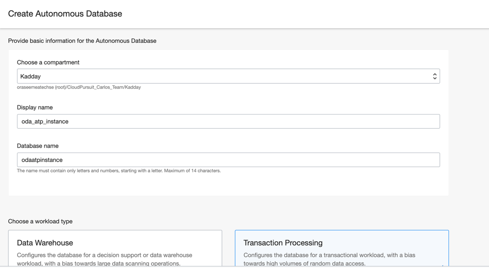
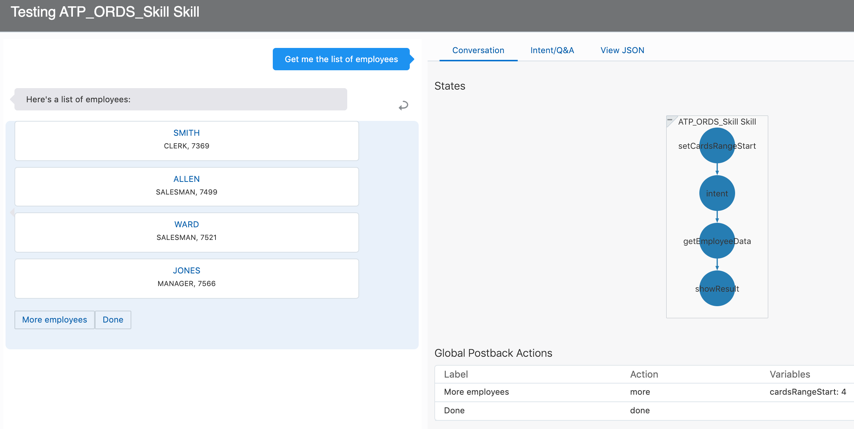

# Connecting your Conversational Interface to your Cloud Database
<insert lab description>


# Creating the database
Let&#39;s start with you creating the ATP instance, which is your transactional database. When entering the Oracle Cloud Infrastructure (OCI)dashboard, you can either go the quick route and press the button that says **Create a database** or use the hamburger menu top-left **>** **Autonomous Transaction Processing**.


Now choose the compartment in which you want to deploy the instance, give it a display & database name. We’re also going with the **Transaction Processing** as workload and **Serverless** as a deployment type. 



You can decide how much resources you need for the database (**1 CPU Core, 1 TB Storage** is set as a default). Choose **Transaction Processing**.


After you provided the administrator credentials, leave the license type as is and press the blue **Create Autonomous Database** button on your bottom left. 


You will now have to wait a couple of minutes for the database to provision. But don’t go away from the computer just yet – it took me roughly 2 minutes to get the instance up and running!


When the instance is ready, it’s going to tell you that it is  in green. Now is the time to create the user and enabling ORDS.

# Creating a database user and enabling ORDS
There are various ways of connecting to your database and enabling ORDS. I recommend you to have a look at the getting started guide or, if you want to understand what it’s all about, the "Developing RESTful Services in Autonomous Database" documentation. 
In the following section, you are going to do it using APEX builder and SQL Developer Web which is a visual and simple approach. 

1.	Go to **Service Console > Development** and then **SQL Developer Web**
2.	Login with your admin credentials which you defined when you created the instance
3.	You should now be at the **Worksheet**. Paste this snippet into it and press . Do not forget that you should replace ```TESTUSER``` and ```<password>;``` with your user and password

```SQL
CREATE USER TESTUSER IDENTIFIED BY <password>;
GRANT "CONNECT" TO TESTUSER;
GRANT "RESOURCE" TO TESTUSER;
ALTER USER TESTUSER QUOTA UNLIMITED ON DATA;

BEGIN

ords_admin.enable_schema(
p_enabled => TRUE,
p_schema => 'TESTUSER',
p_url_mapping_type => 'BASE_PATH',
p_url_mapping_pattern => 'TESTUSER',
p_auto_rest_auth => NULL
);

commit;

END;
```

4. You’ve now created a user and ORDS-enabled that schema

#Creating a workspace and loading sample data

Log out and go back to the **Development** page where you found the link to the **SQL Developer Web portal**. Go to **Oracle APEX > Administration Services** and log in with your admin account. 


Press the  button and choose the newly created user.


Your workspace is created, go top-right to log out of your admin account and log in to your user that you created earlier. 
To keep it simple, you will provision your database with a sample dataset. Go to **SQL Workshop > Utilities > Sample Datasets** and install the **EMP / DEPT** dataset. 


When done, go back to **SQL Workshop > RESTful services** and click on the blue button on the top right that says **Register Schema with ORDS**. You can leave everything as is for now, no need for any authentication. If you’d like to add authentication to your endpoint then this can be done under **Privileges** under the **RESTful Data Services** section. 


On the left hand-side you see information about the modules that were created for you, as well as  how you can consume the API. 
Go to the **Modules** section and click on ```employees/```. This will give you some information about that specific endpoint as well as the full URL details. You are going to use this endpoint throughout the remaining of this tutorial, so make sure you copy and save it. 


You can use any REST Client to access the data. This tutorial uses Postman. If you can access the data then you are good to go to integrate ORDS in Oracle Digital Assistant.


# Import the Sample Skill

This tutorial assumes you to be experienced with Oracle Digital Assistant. If you are not, then it is time for a break to exercise a beginners tutorial:

https://docs.oracle.com/en/cloud/paas/digital-assistant/tutorials.html

To integrate calls to ORDS in Oracle Digital Asisstant, you need to import the sample skill provided with this article to your Oracle Digital Assistant instance. In Oracle Digital Assistant, use the "hamburger" icon top-left and select Development -> Skills. Then …

1.	Press  top right
2.	Open the imported skill and press the  button. 
3.	In the opened dialog, keep the default Ht Trainer setting. 
4.	When you’ve done that, go to the Settings panel () and select the Configuration tab. 
5.	Click on the ordsUrl skill parameter and press Edit to replace the value of <ords-url> with your ORDS employees/ endpoint.
  
Go to  top-left. You see 3 intents:

- **GetEmployee**: this intent is populated with utterances that gets us the list of employees
- **Greeting**: greets us when we start a conversation
- **ShowHireDate**: gets us the date an employee was hired


# Understanding the Dialog flow

Dialog flows in Oracle Digital Assistant define the conversation flow as well as local variable that the skill uses to temporarily save information like user entries or information queried from a backend. 
The **intent state** (see image below) maps intents resolved from user messages to a state in the dialog flow. For example, if the GetEmployee intent gets resolved, then the dialog flow continues with the "getEmplyeeData" state

```YAML
  intent:
    component: "System.Intent"
    properties:
      variable: "iResult"
      optionsPrompt: "Do you want to"
      daIntercept: "always"
    transitions:
      actions:
        GetEmployee: "getEmployeeData"
        ShowHireDate: "resolveEmployee"
        unresolvedIntent: "unresolved"
```

## Understanding the custom component service

Oracle Digital Assistant knows of  2 types of components.

1)	**System components** are built-in components that are available as part of Oracle Digital Assistant. The components provide user interfaces for user input and bot responses, set variables, handle security, integrate translations services and many more. 
2)	**Custom components** are Node.js applications that bot developers built to integrate backend services or to integrate custom business logic

```YAML
  getEmployeeData
    component: "getEmpTable"
    properties:
      ordsUrl: "${system.config.ordsUrl}"
    transitions: 
      actions: 
        next: "showResult"
        error: "errorOutput"
```

Shown in the image above, the component property of the **getEmployeeData** state references **"getEmpTable"**, which is a custom component developed for this article. **getEmpTable** is the component name of a class called **GetTable.js**.

The custom component uses an input parameter for bot designers to provide the ORDS endpoint URL. The value of the property, in this example, is read from the skill parameter you configured earlier.

**Next**, click the  icon in the left side menu. 


Notice the custom components that have been provided with the skill. To examine the custom
components, download the **atp_ords-1.0.0.tgz** file by clicking on it and unzip it.

## Working with the bots-node-sdk

Before jumping into this section, I assume that you’re familiar with custom components. Let’s just briefly go through the component to refresh your memory. 
Have a look at the **GetTable.js**, which is the custom component used in the flow.
1.	The metadata part of the component defines 
- the **name** of the custom component: during design time, when uploading/establishing a connection to the custom component service, ODA needs to know how it can refer to each component
- the **properties** or the attributes that needs/might be sent in: what variables that are sent in and in what format
- the **supportedActions** - what are the next possible actions in the flow 
The input parameter – **ordsUrl** - you've seen in a previous image id defined in this section too. 

```js
metadata: () => ({
    name: 'getEmpTable',
    properties: {
      ordsUrl: { required: true, type: 'string' }
    },
    supportedActions: ['next', 'error']
  }
 ```

2. The **invoke** function has 2 arguments defined: **conversation**, which gets a reference to the
Oracle custom component SDK, and **done** which is a callback to invoke at the end of the
custom component processing. 

```js
invoke: (conversation, done) => {
```

3.	The if-statement shown below handles errors if they occur when invoking the ORDS REST service. In the case of an error, the custom component "triggers" navigation to a state that is configured to the component's "action -> error" transition.

```js
if (error) {
 conversation.logger().info("Error: " + error);
 conversation.transition('error');
 }
```

4. The rest of the code retrieves the data from the database and stores it in an Oracle Digital Assistant variable called empArr. Additional commentary can be found in the source code

## Testing the skill

Test the sample skill and custom component using the embedded conversation tester (). In the "Message" field, type ```Get me the list of employees```. The bot response is shown in the image below and should be what you see too. 



Press on ```More employees``` button.


As you can see, the rest of the employees gets rendered and now the ***More employees** button disappears! Press **Done**.

# About the System.CommonResponse component

The System.CommonResponse component can be used to stamp values from an array as list of values, or cards. Remember that the empArr variable populated with data in the custom component?  That variable holds a JSON array queried from the ORDS service. This is how data queried from the database get visualized in the bot responses. 
Go back to the dialog flow ()  and go to the **getEmployeeData** state. As you can see, **next** is mapped to the **showResult** state which uses System.CommonResponse.


# Examining the YAML and testing it

Since ORDS is exposing your data as a REST endpoint, it makes it possible for you to query that specific endpoint asking for the data you’d like to retrieve from your database. This use-case showcases a simple way to extract keywords – also called entities – from a user input which we then can use to query the database. 


On the top-right corner we can see what entities that’re linked to what intent. In this case Employee is the associated entity to the **ShowHireDate** intent. If we’d like to add more entities we’d press the  button. Click on  and you will be taken to the entities section.

The intent is associated with entities and makes it possible for us to extract values from user messages. In this case it helps you to distinguish who you want to know the hire date for. We have a list of values, which are the employees, as well as **Fuzzy Match** enabled to give room for errors for the spelling. The **Disambiguation Resolution** makes sure that we can get information for one employee at a time and the  section guides the end-user to the right path f.e. when asked for an employee that’s not in the list. 

Feel free to examine the entities.


On to the flow – as mentioned, the **System.Intent** state maps the user input to a dialog flow state defined for the intent.

```YAML
  intent:
    component: "System.Intent"
    properties:
      variable: "iResult"
      optionsPrompt: "Do you want to"
      daIntercept: "always"
    transitions:
      actions:
        GetEmployee: "getEmployeeData"
        ShowHireDate: "resolveEmployee"
        unresolvedIntent: "unresolved"
```

In this case we can see that the intent is directing us to a state called **resolveEmployee**.

```YAML
  resolveEmployee:
    component: "System.ResolveEntities"
    properties:
      variable: "employee"
      nlpResultVariable: "iResult"     
      maxPrompts: 2
      cancelPolicy: "immediate"
    transitions:
      actions:
        cancel: "noEmployee"
        next: "getEmployeeHireDate"
    
  getEmployeeHireDate:
    component: "getEmpHireDate"
    properties: 
      ordsUrl: "${system.config.ordsUrl}"
      employee: "${employee.value}"
    transitions: 
      actions: 
        next: "finish"
        error: "errorOutput"
```

The **resolveEmployee** state is a **System.ResolveEntities** state. Here, we check if we have any entity-hits in the **nlpResultVariable** called **iResult**. This is where the nlp stores any relevant information found from the user utterance, we’re scanning it for relevant data (in this case an entity) and store it in the **employee** variable. What’s interesting here is that if the entity is found, the component slots it automatically for us. If we would write something like:


Then the component already has what it needs to send us to the **next** state since **Allen** is one of the entities in the list. If you would try something like this though:


Then the bot will ask you what specific information you’re looking for since it cannot find any entities it knows about. This is where our prompts come to use from the entities section. 

# Working with the NLP data and creating cards through the backend

The **getEmployeeHireDate** component is a custom component in which you send in two attributes; the entity match, received from the **resolveEmployee** state, and of course the ORDS ```employees/``` endpoint. 
Go back to your component folder. In there, you can find another NodeJS class called **GetEmployeeHireDate.js** (or **getEmpHireDate**, which would be the custom component name). This class;
- receives ***two*** attributes in the metadata section; ```ordsUrl``` (which is our ORDS endpoint) and ```employee``` (which is the name of the employee we’re searching for)
- has 2 supported actions; ```next``` and ```error``` – just like the previous component
- retrieves data by querying the ORDS service in our database
- loops through the data retrieved and uses the bots-node-sdk to build the responsive layout
This excerpt shows what it looks like when building the response items with the data received. Feel free to go through the code and alter it if need be. The sample code has some additional commentary in it that will help you understand it better.

This excerpt shows what it looks like when building the response items with the data received. Feel free to go through the code and alter it if need be. The sample code has some additional commentary in it that will help you understand it better.

```js
    var bodyResponse = JSON.parse(body);

    //conversation.logger().info("Data received: \n" + JSON.stringify(bodyResponse));

    // Loops through the JSON we got as a response from doing our REST call to the ATP ORDS endpoint
    for (var i in bodyResponse.items) {

      // Here we make sure we popoulate our variables with the right values retrieved from the database
      var employeeName = JSON.stringify(bodyResponse.items[i].ename).slice(1, -1);
      var employeeNumber = JSON.stringify(bodyResponse.items[i].empno);
      var job = JSON.stringify(bodyResponse.items[i].job).slice(1, -1);
      var hireDate = JSON.stringify(bodyResponse.items[i].hiredate).slice(1, -11);

      // Pushing the right actions to our actions-array
      actionArr.push(MessageModel.callActionObject('Call', '', '+461234567'));

      // Pushing the objects to our conversation
      cardArr.push(MessageModel.cardObject (
          employeeName, 
          job + ', ' + 
          employeeNumber + ', ' + 
          hireDate, '', '', 
          actionArr
        ));
      
      // Creating a textConversationMessage object
      text = MessageModel.textConversationMessage (
          employee + ' who is a ' + 
          job + ' with the employee number ' + 
          employeeNumber + ' was hired ' + 
          hireDate + '.'
        );
    }
```

figure 24: the engine understands **what** we want to do, but not **which** employee we would like to search for. as you can see, it asks us for a specific employee nameThen the bot will ask you what specific information you&#39;re looking for since it cannot find any entities it knows about. This is where our prompts come to use from the entities section.
# Working with the NLP data and creating cards through the backend
The **getEmployeeHireDate** component is a custom component in which we you retrieve send in two attributes; the entity match, received from the **resolveEmployee** state, and of course the ORDS **employees/** endpoint. the url to our ATP endpoint, just like the previous custom component. In this case however, we also send in the entity we retrieved from the **resolveEmployee** state in our **employee** stringvariable. We had a look at the component service in the previous section and we dissected the **GetTable.js** class or **getEmpTable** which is the custom component name. In the same folderGo back to your component folder. In there,,you can find there&#39;s another NodeJS class called **GetEmployeeHireDate.js** **(**which is ouror **getEmpHireDate** , which would be the custom component name)component. This class;
- receives **two** attributes in the metadata section; **ordsUrl** (which is our ORDS endpoint) and **employee (**which is the name of the employee we&#39;re searching for)
- has 2 supported actions; **next** and **error –** just like the previous component
- retrieves data by querying the ORDS service in our database
- loops through the data retrievedand uses the bots-node-sdk to build the responsive layout
-
This excerpt shows what it looks like when building the response items with the data received. Feel free to go through the code and alter it if need be. The sample code has some additional commentary in it that will help you understand it better.Then we have the first 2 lines, which are sent in and extracted from the metadata. **urlQuery** is a string that defines the ORDS query with the right employee name retrieved earlier. The rest are arrays that will be used for us to build the cards as well as a **text** variable that will be used for us to store a text object.  const { ordsUrl } =conversation.properties();  const { employee } =conversation.properties();  varurlQuery=&#39;?q={&quot;ename&quot;:{&quot;$like&quot;:&quot;%25&#39;+employee+&#39;%25&quot;}}&#39;;  varcardArr=newArray();  varactionArr=newArray();  vartext;Moving forward, we can see that the code is very similar to what we did in the previous component where the **request** module helps us do the necessary REST calls to our ATP endpoint. There&#39;s also some if-statement that simplifies debugging. The next step is then to loop through the JSON object retrieved by the ATP instance and create a card for each object. Let&#39;s dissect the code;    varbodyResponse=JSON.parse(body);     _//conversation.logger().info(&quot;Data received: \n&quot; + JSON.stringify(bodyResponse));_     _// Loops through the data retrieved from ATP_    for(variinbodyResponse.items){       _// Populating the variables with employee data_       varemployeeName=JSON.stringify(bodyResponse.items[i].ename).slice(1,-1);      varemployeeNumber=JSON.stringify(bodyResponse.items[i].empno);      varjob=JSON.stringify(bodyResponse.items[i].job).slice(1,-1);      varhireDate=JSON.stringify(bodyResponse.items[i].hiredate).slice(1,-11);       _// Pushing the right actions to our actions-array_      actionArr.push(MessageModel.callActionObject(&#39;Call&#39;,&#39;&#39;,&#39;+461234567&#39;));       _// Pushing the objects to our conversation_      cardArr.push(MessageModel.cardObject(          employeeName,          job+&#39;, &#39;+          employeeNumber+&#39;, &#39;+          hireDate,&#39;&#39;,&#39;&#39;,          actionArr        ));            _// Creating a textConversationMessage object_      text=MessageModel.textConversationMessage(          employee+&#39; who is a &#39;+          job+&#39; with the employee number &#39;+          employeeNumber+&#39; was hired &#39;+          hireDate+&#39;.&#39;        );    }
- The **for-loop** runs through the objects in the JSON array which is defined as bodyResponse.items. In this case we only have one employee each with a unique name, but you would imagine if we had multiple employees called Allen f.e.
- The variables in the beginning is where we store the attribute we need. The slice is used to format the data so we leave out unnecessary characters.
- Notice that we have a MessageModel object declared at the top using the @oracle/bots-node-sdk/lib We&#39;re using the SDK object called MessageModel to create the actions needed. In this case we only have **one** action defined which is a call label with a hardcoded phone number. This is pushed to our array of actions called
- For every employee in the array, we create a card using the MessageModel.cardObject function with the attributes we see fit. Then we push it to the cardArr array.
- MessageModel.textConversationMessage is just a showcase that we could create text objects using the MessageModel as well
When we&#39;re done creating the cards, the response objects are built that can be sent back to the ODA platform and we&#39;ll use the conversation.reply which executes the output for us.     varcardConvObj=MessageModel.cardConversationMessage(&#39;vertical&#39;,cardArr);    conversation.reply(cardConvObj);    conversation.reply(text);Feel free to go through the code and alter it if need be. The sample code has some additional commentary in it and there&#39;s links that will help you understand the ODA framework a bit better at the end of this article.ConclusionThis article shows how ORDS can make your databases accessible by ODA with the help of CRUD functions. It showcases how you In this article we managed to REST-enable our an ATP instance, retrieve data from it and also query our the database for specific data – all while leveraging the natural language processing in Oracles Digital Assistant.   | |
